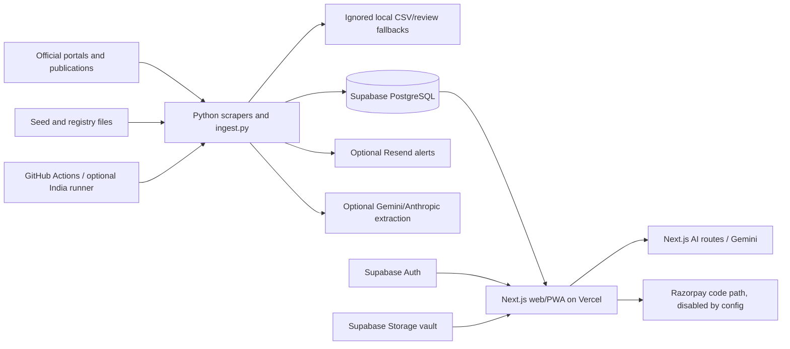

# OPPORTA architecture baseline

Baseline: commit `7190213351562a431d1bbe86ad00ae7e6d3c6466`,
audited 2026-07-28.

## Supported architecture

The launch product is `frontend/` plus Python ingestion and Supabase. Root
Streamlit and `mobile/` Flutter remain in the repository as frozen legacy
clients.

## Components

| Component | Location | Responsibility | Current deployment/runtime |
|---|---|---|---|
| Next.js 16 / React 19 web PWA | `frontend/` | Public discovery, auth, role dashboard, profiles, saves, admin, AI, payments shell | Vercel |
| Python ingestion | `ingest.py`, `scrapers/`, registries | Scrape, normalise, deduplicate, local fallback, Supabase upsert, alert dispatch | GitHub Actions, optional self-host/VM/Windows scheduler |
| Supabase | hosted project plus root SQL | PostgreSQL, Auth, Data API, Storage, Edge Functions | Production project exists; schema not reproducible from Git |
| Edge Functions | `supabase/functions/` | Mobile bid and job intelligence using Gemini | Deployment/auth configuration unknown |
| Streamlit legacy | root `app.py`, `streamlit_app.py` and helpers | Older full product/client with local fallback | Historical Streamlit URL referenced |
| Flutter legacy | `mobile/` | Android/mobile client against Supabase and Edge Functions | AAB workflow exists |

## Frontend route map

### Public discovery and acquisition

- `/`, `/tenders`, `/tenders/[id]`, `/jobs`, `/jobs/[id]`
- `/analytics`
- `/login`, `/signup`, `/forgot-password`, `/reset-password`
- `/bid-documents`, `/exam-planner`
- generated `/manifest.webmanifest`, `/robots.txt`, `/sitemap.xml`

### Role/authenticated

- `/dashboard`: server-side user and role check.
- `/profile`, `/saved`, `/select-role`: static/client-side auth context;
  database protection relies on RLS.
- `/auth/callback`: Supabase code/OTP exchange and same-origin redirect.

### Admin

- `/admin`, `/admin/discovery`: server-side email allowlist.
- `/api/admin/cleanup`: archive or irreversible purge using service role.
- Baseline defect: allowlist falls back to a hardcoded founder email, and admin
  queries use the public Supabase client even for private operational tables.

### AI

- `/api/ai/analyze`, `/api/ai/draft`, `/api/ai/eligibility`
- `supabase/functions/bid-engine`, `supabase/functions/intelligence`
- Baseline defect: Next.js routes are public and unmetered; shared results can be
  generated from browser-provided content and cached against a canonical ID.
  Edge Function code has no explicit user/quota/size checks.

### Payments

- `/api/payments/create-order`: authenticated and feature-flagged.
- `/api/payments/webhook`: HMAC signature check.
- Baseline defect: the schema and complete idempotent entitlement/event model
  are absent. Keep production activation disabled.

## Ingestion flow

Current logical flow:

1. Load registry and seed/archive rows.
2. Run many scrapers in one process with per-scraper exception isolation.
3. Collect special corrigendum/district/newspaper/generic-AI sources.
4. Apply strict health only when the optional CLI flag is passed.
5. Deduplicate and normalise.
6. Write local CSV/review files.
7. Upsert batches to Supabase, fall back to row-by-row writes on errors.
8. Silently skip some failed rows.
9. Permanently delete expired tender/job/corrigendum rows.
10. Send alerts.

The scheduled workflow currently calls `python ingest.py`, not
`python ingest.py --strict-health`. Source writes are not checkpointed as
independent durable units, and no `ingestion_runs`/dead-letter schema exists.

## Trust boundaries

- Browser/public mobile clients may contain the Supabase publishable/anon key;
  all private and authoritative data therefore depends on correct grants and
  RLS.
- Service-role keys belong only in trusted Python/server/Edge environments.
- Opportunity source text is untrusted external input.
- User uploads and AI prompts/outputs are untrusted and advisory.
- Payment webhooks are untrusted until signature, event, order, amount, user,
  currency, state, and idempotency checks pass.
- Self-hosted runners execute repository workflows and handle production
  secrets; they are production infrastructure.

## Duplicated architecture and drift

- Three user clients implement overlapping data/auth/business behaviour:
  Next.js, Streamlit, and Flutter.
- AI/matching logic exists in TypeScript, Python, Dart, and Edge Functions.
- Supabase table access is duplicated across all three clients and ingestion.
- Database state is split across overlapping manual SQL files and dashboard
  instructions.
- Ingestion can be scheduled by GitHub Actions, a Linux systemd timer, or a
  Windows Scheduled Task.

M1–M7 should centralise server-side lifecycle, schema, auth, matching, and
operational contracts while keeping frozen clients compatible.
